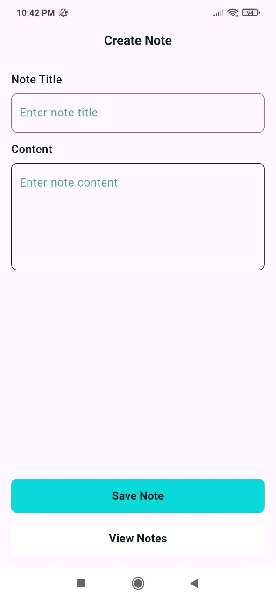
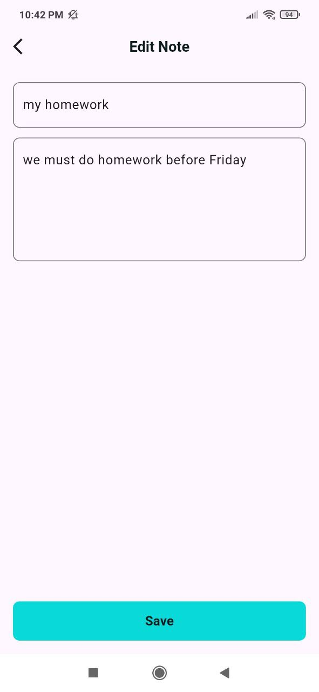
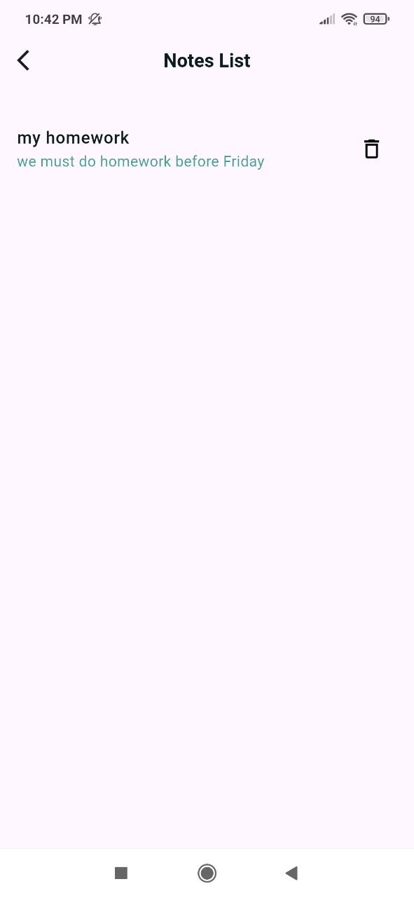

# 📝 Note App

A simple **Flutter** application for managing notes.  
It allows adding, editing, viewing, and deleting notes with an easy-to-use interface.

---

## 📸 Screenshots

### Add Note


### Edit Note


### Note Details


### Notes List


---

## 🎥 Demo Video
Watch the demo video here:  
[▶️ Click to watch](https://youtube.com/shorts/Pc1cpzO4cTQ)

---

## 🚀 Features
- Add and edit notes  
- View note details  
- Simple and clean UI  
- Local storage  

---

## 🛠️ Requirements
- Flutter SDK  
- Dart  
- Android Studio or VS Code  

---

## ▶️ How to Run
```bash
flutter pub get
flutter run
