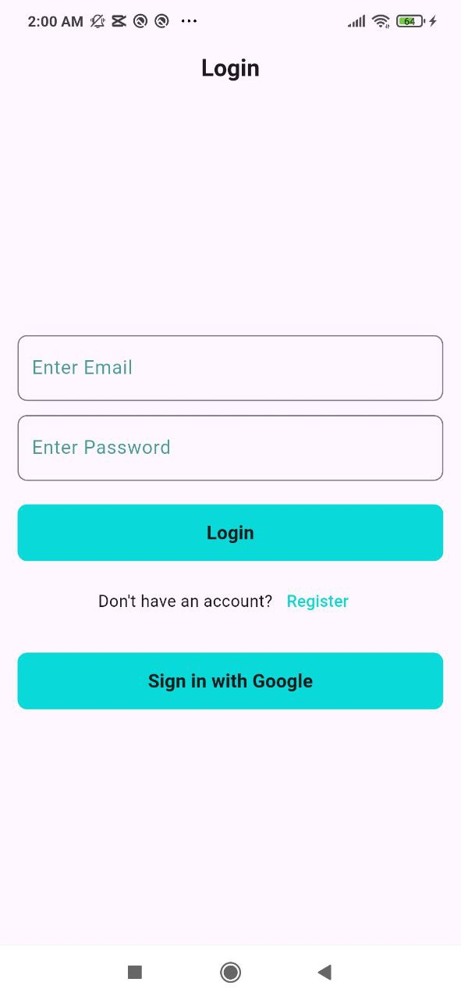
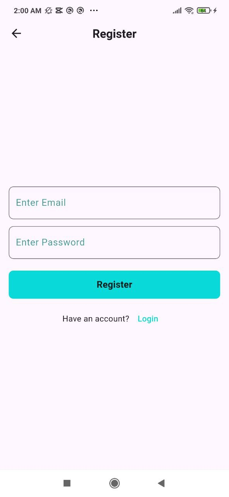
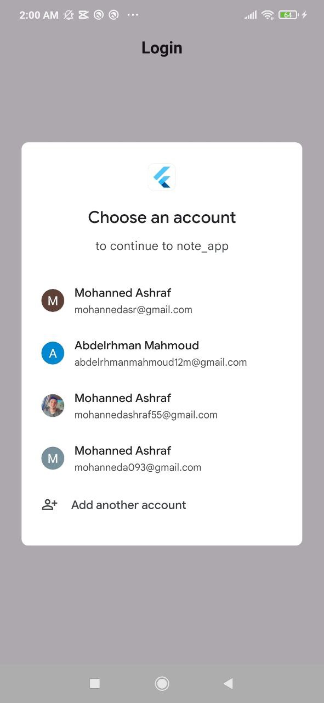
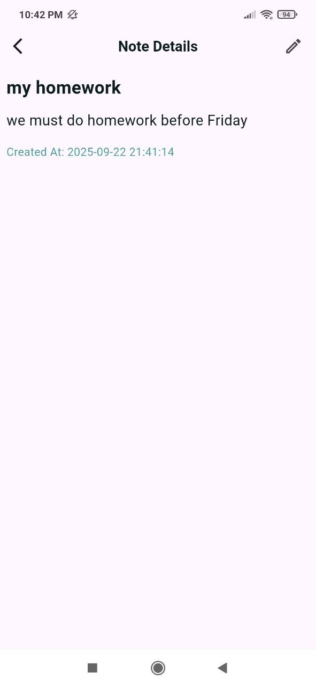

# 📝 Note App

A Flutter-based simple note-taking application.

---

## 📸 Screenshots

### Login

### Register

### Google Sign In

### Add Note

### Edit Note

### Note Details

### Notes List

---

## 🎥 Demo Video

---

## ⚙️ Features
- Login with Google
- Add and edit notes.  
- View note details.  
- Simple and clean user interface.  
- Local storage support.  

---
